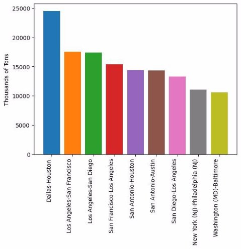
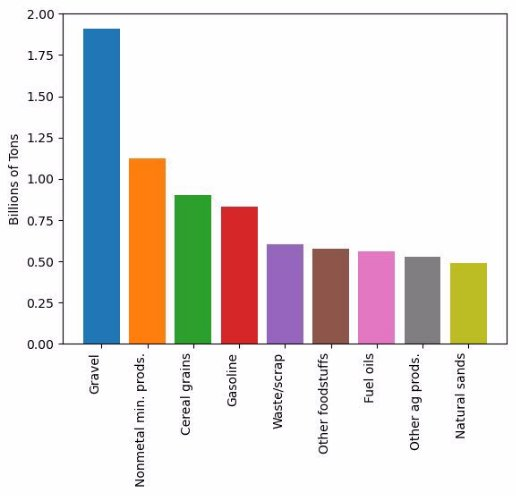
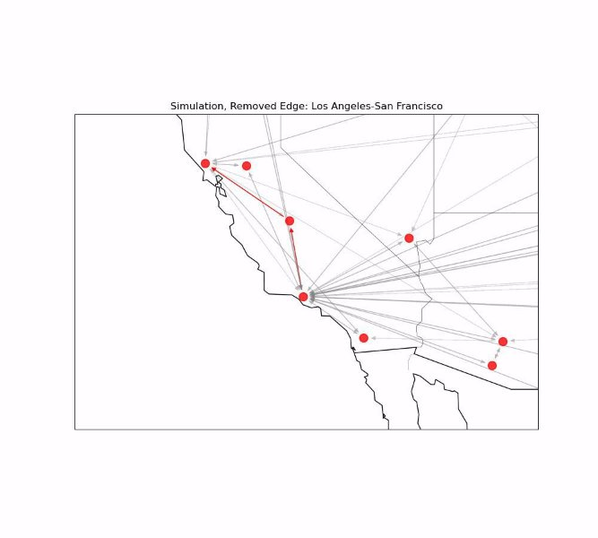
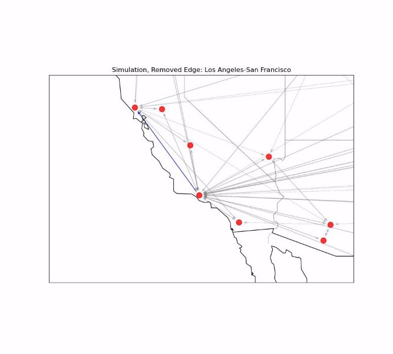
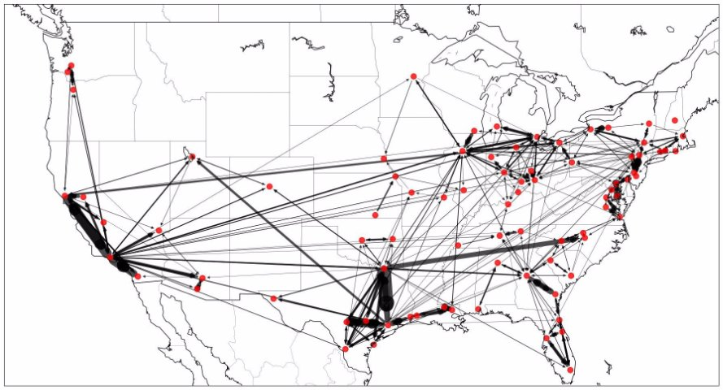
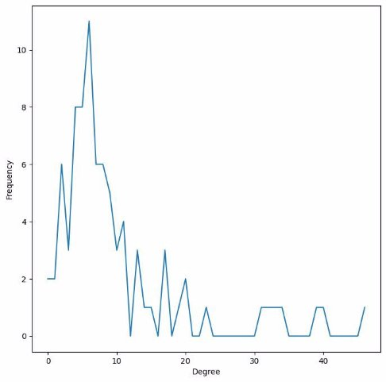
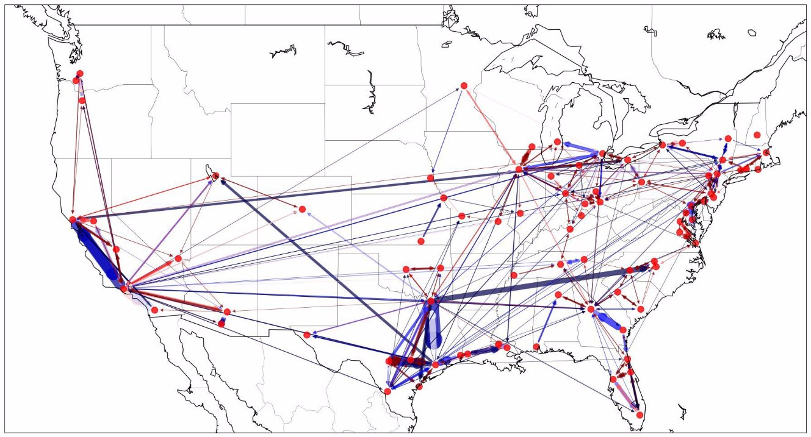

***Simulating Disruption Events in the US ***

***Highway Freight Network***

Ananya Bishnoi, Frank Tucci, Luke Franks, Miya Reese Advised by Dr. Theresa Migler

Overview The most highway freight density is found in the California, Texas Triangle, Midwest, and East Coast regions. The most connected nodes, measured 

The  US  Department  of  Transportation  releases  a  yearly  report  of  using closeness centrality, are often central to these areas.

aggregate US freight data as part of the Freight Analysis Framework 

(FAF). This contains data of the origin and destination of shipments, 

mode of transportation, and estimated weight and value. 11.7 billion 

tons  of  cargo,  worth  roughly  $15  trillion  dollars  was  shipped  on  Simulation Design

domestic, point-to-point trips on US highways in 2022.

To simulate a disruption event that blocks travel between two city pairs, we remove an arbitrary edge from the graph. The next-shortest route is then calculated, and the cargo is re-routed through at least one intermediate node on the way to its destination. This increased load can be stored as an edge attribute and used to calculate an increase as a percentage to the edge’s normal throughput to identify which highways may be more vulnerable to an increase in traffic when a nearby edge fails.

**Figure 1:** Top 10 city pairings and commodity types

Network Construction

The network was modeled using the FAF’s statistical metro areas as  **Figure 3:** A path from Los Angeles to San Francisco (Blue) is rerouted nodes  and  tons  of  cargo  transported  between  the  the  origin  and  through Fresno (Red)  after a disruption event

destination nodes as directed edges. Edge weights represent tons of 

cargo. We looked only at trade corridors with greater than 500,000  This simulation can be repeated so that each edge in the graph is removed tons of cargo shipped in the continental US only. exactly  once,  and  the  increased  load  factor  averaged  by  the  number  of 

simulations to determine how vulnerable a road is to strain resulting from a disruption event.

Findings

**Figure 2:** Map of the constructed network and degree distribution

|**Metro Area**|**Closeness Centrality**|
| - | - |
|Atlanta|0\.50|
|Los Angeles|0\.49|
|Detroit|0\.48|
|Chicago (IL)|0\.47|
|Dallas|0\.46|

**Figure 4:** Color overlay with edges in red being found to be the most vulnerable to congestion, and blue being the least.

 

|**Edge**|**Average Increase in Thousand Tons**|
| - | - |
|Dallas-Houston|24511|
|Los Angeles-San Francisco|17562|
|Los Angeles-San Diego|17430|
|San Francisco-Los Angeles|15352|
|San Antonio-Houston|14372|

|**Edge**|**Proportion of Starting Value**|
| - | - |
|Corpus Christi-Austin|1\.11|
|Washington (DC)-Baltimore|1\.08|
|Richmond-Washington (DC)|1\.06|
|Fresno-Sacramento|1\.05|
|Austin-Corpus Christi|1\.05|

**The city pairs most vulnerable are the small to medium-sized cities that run parallel to already large highway trade corridors**. Cataloguing  this  information  is  likely  of  interest  to  transportation planners  and  emergency  response  crews  who  rely  upon  similar models to plan for and be able to take advanced action in the result of a highway disruption.  

Future Work

Next steps in this project would involve taking a more in-depth look at the US highway system to construct a more realistic model of the US  Interstate  system,  rather  than  a  point-to-point  based  network simulation  as  done  here.  Additionally,  we  could  look  at  a  more realistic route-assignment algorithm that can split a shipment over multiple paths, or across multiple modalities of transportation (like rail).

References

Bureau of Transportation Statistics. Freight Analysis Framework 5. Available online: https://www.bts.gov/faf
